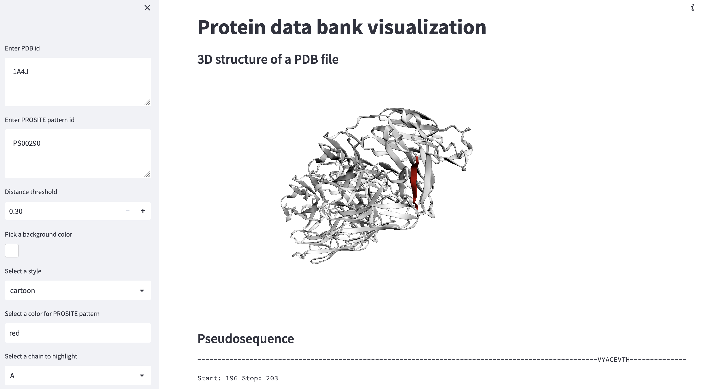

# 3D Protein vizualizer

The demo app that visualizes proteins 3d structure

## How to run the app?
### Locally

pip install -r requirements.txt

streamlit run app.py

### Through docker

docker build . -t "viz:v1"

docker run -p 8501:8501 "viz:v1"

By default you can access the app here: http://localhost:8501/